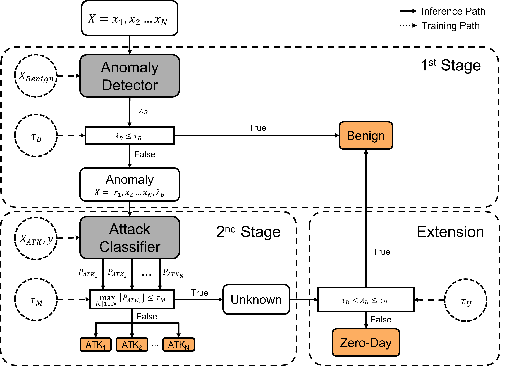

# A Novel Multi-Stage Approach for Hierarchical Intrusion Detection - TNSM 2023



This repository contains code and results for the academic paper titled "[A Novel Multi-Stage Approach for Hierarchical Intrusion Detection](10.1109/TNSM.2023.3259474)". The paper was published in **IEEE Transactions on Network and Service Management (TNSM)** in **April 2023**. 

Authors: [Miel Verkerken](https://scholar.google.be/citations?user=WiZwBjoAAAAJ), [Laurens D’hooge](https://scholar.google.be/citations?user=NQe4w9UAAAAJ), [Didik Sudyana](https://scholar.google.be/citations?user=piXtDB4AAAAJ), [Ying-Dar Lin](https://scholar.google.be/citations?user=BiG37KwAAAAJ), [Tim Wauters](https://scholar.google.be/citations?user=Kvxp9iYAAAAJ), [Bruno Volckaert](https://scholar.google.be/citations?user=NIILGOMAAAAJ) and [Filip De Turck](https://scholar.google.be/citations?user=-HXXnmEAAAAJ)

## Abstract

An intrusion detection system (IDS), traditionally an example of an effective security monitoring system, is facing significant challenges due to the ongoing digitization of our modern society. The growing number and variety of connected devices are not only causing a continuous emergence of new threats that are not recognized by existing systems, but the amount of data to be monitored is also exceeding the capabilities of a single system. This raises the need for a scalable IDS capable of detecting unknown, zero-day, attacks. In this paper, a novel multi-stage approach for hierarchical intrusion detection is proposed. The proposed approach is validated on the
public benchmark datasets, CIC-IDS-2017 and CSE-CIC-IDS-2018. Results demonstrate that our proposed approach besides effective and robust zero-day detection, outperforms both the baseline and existing approaches, achieving high classification performance, up to 96% balanced accuracy. Additionally, the
proposed approach is easily adaptable without any retraining and takes advantage of n-tier deployments to reduce bandwidth and computational requirements while preserving privacy constraints. The best-performing models with a balanced set of thresholds correctly classified 87% or 41 out of 47 zero-day attacks, while
reducing the bandwidth requirements up to 69%.

## Code

The code to reproduce the experimental results obtained in the paper are available in the notebook `code.ipynb`. Depending on your environment you might need to install some libraries to run the code and reproduce the cell outputs.

## Optimized Models & Data

The optimized models and data, used in the `code.ipynb` notebook to obtain the results, are respectively available in the `models` and `data` directory. The models are available as a pipeline consisting of both the feature scaler and prediction model combined as well as feature scaler and prediction model separetly. The used testing data is available in both csv and parquet format.

| Stage                        | Model                  | File                                                                                           | Description                                                                                                                                                                        |
|------------------------------|------------------------|------------------------------------------------------------------------------------------------|------------------------------------------------------------------------------------------------------------------------------------------------------------------------------------|
| Stage 1                      | One-Class SVM (OC-SVM) | `stage1_ocsvm.p`<br>`stage1_ocsvm_scaler.p`<br>`stage1_ocsvm_model.p`<br>`stage1_ocsvm_100k.p` | Pipeline with feature scaler and optimized OC-SVM.<br>Fitted feature scaler on training data (10k).<br>Fitted model on 10k benign samples.<br>Fitted model on 100k benign samples. |
| Stage 2                      | Random Forest (RF)     | `stage2_rf.p`<br>`stage2_rf_scaler.p`<br>`stage2_rf_model.p`                                   | Pipeline with feature scaler and optimized RF.<br>Fitted feature scaler on training data.<br>Fitted model on training data.                                                        |
| Baseline                     | Random Forest (RF)     | `baseline_rf_scaler.p`<br>`baseline_rf.p`                                                      | Fitted feature scaler on training data.<br>Fitted model on training data.                                                                                                          |
| Bovenzi et al.<br>(2 stages) | AutoEncoder (AE) & RF  | `sota_stage1.h5`<br>`sota_stage2.p`                                                            | Fitted model (AE) for stage 1 according to Bovenzi et al.<br>Fitted model (RF) for stage 2 according to Bovenzi et al.                                                             |

## Citation

If you use our code or results in your research, please cite our paper as:
```
@ARTICLE{10077796,
  author={Verkerken, Miel and D’hooge, Laurens and Sudyana, Didik and Lin, Ying-Dar and Wauters, Tim and Volckaert, Bruno and De Turck, Filip},
  journal={IEEE Transactions on Network and Service Management}, 
  title={A Novel Multi-Stage Approach for Hierarchical Intrusion Detection}, 
  year={2023},
  volume={},
  number={},
  pages={1-1},
  doi={10.1109/TNSM.2023.3259474}}
  ```


## Contact

If you have any questions or comments regarding the paper, code, or results, feel free to contact the corresponding author at Miel.Verkerken@UGent.be. We welcome any feedback or suggestions for future work in this area. 

## License

Please refer to the `LICENSE.md` file for more information on the license terms and conditions.